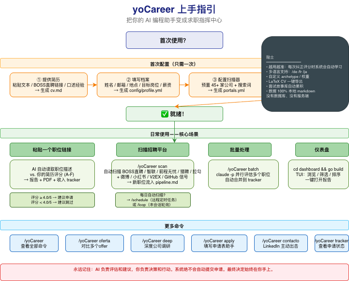

# yoCareer v2：AI 赋能求职系统

[English](README.md) | [简体中文](README.cn.md) | [繁體中文](README.zh-TW.md) | [项目主页](README.yocareer.md)

> **v2.0.0 更新**：全新 daemon + SQLite 架构、浏览器 SPA 仪表盘、浏览器扩展、Mirofish 设计系统。

<u>很多人花几个月时间用笨办法找工作。所以我设计了一个希望能派上用场的系统。</u>\
公司用 AI 筛选候选人。我只是给候选人提供了 AI 来_选择_公司。\
<u>现在它开源了。</u>

---

**评估了 740+ 个职位 · 生成了 100+ 份个性化简历 · 拿到了 1 个梦想职位**

yoCareer 将任何 AI 编码命令行界面转变为完整的求职指挥中心。你不再需要在电子表格中手动跟踪申请，而是获得一个 AI 驱动的流程：

- **评估职位**，采用结构化的 A-F 评分系统（10 个加权维度）

- **生成定制 PDF** -- 针对每个职位描述定制的 ATS 优化简历

- **自动扫描招聘平台**（智联招聘、前程无忧、BOSS 直聘、拉勾网、猎聘网、脉脉、小红书、微信公众号、公司官网）

- **批量处理** -- 使用子代理并行评估 10+ 个职位

- **统一跟踪**所有内容，并进行完整性检查

> **重要提示：这不是一个海投工具。** yoCareer 是一个过滤器 -- 它帮助你从数百个职位中找到少数值得你花时间的机会。系统强烈建议不要申请评分低于 4.0/5 的任何职位。你的时间很宝贵，招聘人员的时间也是。提交前请务必审查。

yoCareer 是智能代理式的：AI Agent 使用 Playwright 导航招聘页面，通过推理你的简历与职位描述的匹配度来评估适配性（而非关键词匹配），并为每个职位定制你的简历。

> **注意：最初的评估不会很好。** 系统还不了解你。给它提供上下文 -- 你的简历、你的职业故事、你的证明材料、你的偏好、你擅长什么、你想避免什么。你培养它越多，它就越好。把它想象成培训一个新招聘人员：第一周他们需要了解你，然后他们就会变得非常有价值。

由一位使用它评估了 740+ 个职位、生成了 100+ 份定制简历并成功获得应用 AI 负责人职位的人打造。



## 核心功能

| 功能 | 描述 |
| --- | --- |
| **自动化流程** | 粘贴一个 URL，获得完整评估 + PDF + 跟踪记录 |
| **6 模块评估** | 职位摘要、简历匹配、级别策略、薪酬研究、个性化、面试准备（STAR+R） |
| **面试故事库** | 跨评估积累 STAR+反思故事 -- 5-10 个核心故事可以回答任何行为面试问题 |
| **谈判脚本** | 薪资谈判框架、地域折扣反驳、竞争 offer 杠杆 |
| **ATS PDF 生成** | 使用 Space Grotesk + DM Sans 设计的关键词注入简历 |
| **招聘信号扫描器** | China-first provider 架构：公司官网职位页 + 社媒/社区信号 + 手工导入 + 人工复核队列 |
| **批量处理** | 使用子代理并行评估多个职位 |
| **浏览器 SPA 仪表盘** | Dark-first 网页仪表盘，Cmd+K 命令面板，SSE 实时更新 |
| **浏览器扩展** | Manifest V3，一键提取 BOSS直聘 / 拉勾 / 智联职位信息 |
| **人在回路中** | AI 评估和推荐，你决定和行动。系统永远不会提交申请 -- 你始终拥有最终决定权 |
| **流程完整性** | 自动合并、去重、状态规范化、健康检查 |

## 快速开始

```bash
# 1. 克隆并安装
git clone https://github.com/ZCDeng/yoCareer.git
cd yoCareer && npm install
npx playwright install chromium # PDF 生成所需

# 2. 检查设置
npm run doctor # 验证所有先决条件

# 3. 配置
cp config/profile.example.yml config/profile.yml  # 编辑你的详细信息
cp templates/portals.example.yml portals.yml # 自定义公司

# 4. 添加你的简历
# 在项目根目录创建 cv.md，用 markdown 格式填写你的简历

# 5. 使用 AI Agent 个性化（Claude Code / Gemini CLI / Codex / OpenCode / Qwen / Copilot）
claude # 在此目录中打开 Claude Code（或你使用的 CLI）

# 然后让 Claude 根据你的情况调整系统：
# "将原型改为后端工程职位"
# "将模式翻译成英文"
# "将这 5 家公司添加到 portals.yml"
# "用我粘贴的这份简历更新我的个人资料"

# 6. 开始使用
# 粘贴职位 URL 或运行 /yoCareer
```

### 可选增强（推荐）：关联 Aditly 强化搜索/抓取

yoCareer 默认不内置第三方抓取依赖。你可以把 [Aditly](https://github.com/ZCDeng/Aditly) 作为外部能力接入，提升微博/小红书/V2EX/GitHub 等公开信号抓取质量：

```bash
# 1) 启动 Aditly（独立项目）
git clone https://github.com/ZCDeng/Aditly.git
cd Aditly
cp .env.example .env
docker compose -f compose.prebuilt.yaml up -d
curl http://127.0.0.1:8643/health

# 2) 回到 yoCareer，启用桥接偏好（可选）
cd ../yoCareer
cp .env.example .env
# 在 .env 中确认：
# YOCAREER_ADITLY_BASE_URL=http://127.0.0.1:8643
# YOCAREER_ADITLY_PREFER=true
# YOCAREER_ADITLY_TIMEOUT_MS=10000

# 3) 验证桥接状态
npm run providers
npm run bridge:smoke
node scan.mjs --dry-run
```

该集成是“外挂优先 + 本地回退”：Aditly 不可用时，扫描器会自动降级到本地 bridge 逻辑。

> **系统设计为由 Claude 本身进行自定义。** 模式、原型、评分权重、谈判脚本 -- 只需让 Claude 更改它们。它读取它使用的相同文件，所以它确切知道要编辑什么。

详见 [docs/SETUP.md](https://github.com/ZCDeng/yoCareer/blob/main/docs/SETUP.md) 获取完整设置指南。

## 多客户端适配（agentskills.io 标准）

yoCareer 遵循 [agentskills.io](https://agentskills.io) 开放标准，单一 skill 文件服务所有兼容 CLI。所有评估逻辑（`modes/*.md`）在客户端之间共享。

| 客户端 | 启动方式 | 上下文文件 |
|--------|----------|------------|
| **Claude Code** | `claude` → `/yoCareer` | `CLAUDE.md` |
| **Gemini CLI** | `gemini` → `/yoCareer` | `GEMINI.md` |
| **Codex** | `codex` → `/yoCareer` | `AGENTS.md` |
| **OpenCode** | `opencode` → `/yoCareer` | `AGENTS.md` |
| **Qwen Code** | `qwen` → `/yoCareer` | `AGENTS.md` |
| **Copilot CLI** | `copilot` → `/yoCareer` | `AGENTS.md` |

所有客户端共用同一个 skill 定义 `.agents/skills/yoCareer/SKILL.md`；Claude Code 用户额外有 `.claude/skills/yoCareer/SKILL.md` 镜像。统一路由，统一模式文件，无需维护多套命令定义。

### Gemini CLI 示例

```bash
# 1. 安装并认证（免费）
npm install -g @google/gemini-cli
gemini auth

# 2. 在 yoCareer 目录中运行
cd yoCareer
gemini

# 3. 使用斜杠命令
/yoCareer "Anthropic 的高级 AI 工程师..."
/yoCareer scan
/yoCareer pdf
/yoCareer tracker
```

`GEMINI.md` 文件会自动加载为 Gemini 上下文，并自动导入 `AGENTS.md` 作为规范指令。

### 使用 Gemini API（可选）

```bash
# 1. 在 https://aistudio.google.com/apikey 获取免费 API 密钥
cp .env.example .env
# 编辑 .env → 设置 GEMINI_API_KEY=你的密钥

# 2. 安装依赖
npm install

# 3. 评估职位描述
node gemini-eval.mjs "我们正在寻找一名高级 AI 工程师..."
node gemini-eval.mjs --file ./jds/my-job.txt
npm run gemini:eval -- "职位描述文本"
```

> **免费套餐：** 两种选项都无需付费。原生 CLI 使用 Google OAuth；API 脚本使用 `gemini-2.0-flash`（15 RPM，每天 100 万 token 免费）。

## 工作原理

yoCareer 是一个带有多种模式的单一斜杠命令：

```plaintext
/yoCareer → 显示所有可用命令
/yoCareer {粘贴职位描述} → 完整自动流程（评估 + PDF + 跟踪器）
/yoCareer scan → 扫描招聘平台寻找新职位
/yoCareer pdf → 生成 ATS 优化简历
/yoCareer batch → 批量评估多个职位
/yoCareer tracker → 查看申请状态
/yoCareer apply → 使用 AI 填写申请表
/yoCareer pipeline → 处理待处理的 URL
/yoCareer contacto → LinkedIn 外联消息
/yoCareer deep → 深度公司研究
/yoCareer training → 评估课程/证书
/yoCareer project → 评估作品集项目
```

或者直接粘贴职位 URL 或描述 -- yoCareer 会自动检测并运行完整流程。

### 评估流程

```plaintext
你粘贴职位 URL 或描述
        │
        ▼
┌──────────────────┐
│  原型检测        │  分类：LLMOps / 智能代理 / PM / SA / FDE / 转型
└────────┬─────────┘
         │
┌────────▼─────────┐
│  A-F 评估        │  匹配度、差距、薪酬研究、STAR 故事
│  (读取 cv.md)    │
└────────┬─────────┘
         │
    ┌────┼────┐
    ▼    ▼    ▼
 报告   PDF  跟踪器
  .md  .pdf  .tsv
```

## 招聘平台扫描器

扫描器已切换为 **China-first provider 架构**，默认围绕国内用户场景：

- `company_page`：优先扫描公司公开招聘页（Playwright）
- `manual_signal_import`：接收你手工导入的碎片信号（`data/signals.ndjson`）
- `reach_signal_search`：可选公共信号搜索 bridge
- `manual_only`：登录/风控平台默认仅人工导入与复核

默认模板位于 `templates/portals.example.yml`（中文版 `templates/portals.cn.example.yml`），已内置：
- 国内技术公司与 AI 公司跟踪列表
- 适合中国求职市场的 title_filter（AI + 工程 + 产品/运营/增长）
- 社媒和社区信号入口（微博 / 小红书 / V2EX / GitHub 等）

可选增强：关联 Aditly 作为外部抓取能力，详见 [docs/ADITLY_INTEGRATION.md](https://github.com/ZCDeng/yoCareer/blob/main/docs/ADITLY_INTEGRATION.md)。

## 仪表盘（v2 浏览器 SPA）

```bash
npm run ui
# 或
npx yocareer daemon start && npx yocareer ui
```

Dark-first 网页仪表盘，功能包括：
- **模块卡片**：Profile / Portals / Signals / Applications / Evaluations
- **Cmd+K 命令面板**：快速导航、触发扫描、切换模块
- **SSE 实时更新**：任务进度、信号变化自动刷新
- **Mirofish 设计系统**：一致的颜色、间距、动画令牌

### 浏览器扩展（可选）

一键提取 BOSS直聘 / 拉勾 / 智联职位信息到 daemon。

**一键安装（推荐）：**

```bash
curl -fsSL https://raw.githubusercontent.com/ZCDeng/yoCareer/main/scripts/install-extension.sh | bash
```

脚本会自动将扩展安装到 `~/.yocareer/extension/`，并输出浏览器加载步骤。

**手动安装（如果你已经 clone 了仓库）：**

```bash
# 1. 在 Chrome 中打开 chrome://extensions
# 2. 开启"开发者模式"
# 3. 点击"加载已解压的扩展程序"
# 4. 选择 extension/ 目录
# 5. 在任意支持的招聘页面点击扩展图标提取职位
```

扩展需要 daemon 正在运行（`npx yocareer daemon start`）。首次使用需配对：扩展弹出面板 → 输入 6 位配对码 → 自动注册。

### 遗留终端 TUI

Go TUI 仪表盘仍保留在 `dashboard/` 中，但不再主动维护：

```bash
cd dashboard
go build -o career-dashboard .
./career-dashboard --path ..
```

## 项目结构（v2）

```plaintext
yoCareer/
├── AGENTS.md                    # 规范代理指令（所有 CLI 共享）
├── CLAUDE.md                    # Claude Code 专用 → @AGENTS.md
├── GEMINI.md                    # Gemini CLI 专用 → @AGENTS.md
├── cv.md                        # 你的简历（需创建）
├── article-digest.md            # 你的证明材料（可选）
├── config/
│   └── profile.example.yml      # 个人资料模板
├── .agents/
│   └── skills/
│       └── yoCareer/SKILL.md  # agentskills.io 标准 skill
├── .claude/
│   └── skills/
│       └── yoCareer/SKILL.md  # Claude Code 镜像
├── daemon/                      # v2 HTTP daemon（REST API + SSE）
│   ├── routes/                  # API 路由
│   └── models/                  # 数据模型
├── lib/                         # v2 共享库
│   ├── daemon-client.mjs        # 统一 HTTP 客户端
│   ├── ensure-daemon.mjs        # 同步启动辅助
│   ├── db-helpers.mjs           # SQLite 辅助
│   └── v1-detect.mjs            # v1 升级检测
├── web-ui/                      # v2 浏览器 SPA 仪表盘
│   ├── tokens.css               # Mirofish 设计令牌
│   ├── cmdk.js                  # Cmd+K 命令面板
│   ├── sse-client.js            # SSE 实时连接
│   └── main.js                  # 模块路由
├── extension/                   # v2 浏览器扩展（MV3）
│   ├── manifest.json
│   ├── sw.js                    # Service Worker
│   ├── popup/
│   └── content/
├── modes/                       # 技能模式（EN + zh-CN）
│   ├── _shared.md
│   ├── oferta.md
│   ├── pdf.md
│   ├── scan.md
│   ├── batch.md
│   └── zh-cn/                   # 中文模式
├── templates/
│   ├── cv-template.html         # ATS 简历模板
│   ├── capabilities.yml         # 功能注册表
│   └── states.yml               # 规范状态
├── batch/
├── dashboard/                   # 遗留 Go TUI（不再维护）
├── data/                        # SQLite + 跟踪数据
├── reports/                     # 评估报告
├── output/                      # 生成的 PDF
├── docs/                        # 文档
└── examples/                    # 示例
```

## 技术栈（v2）

- **代理**：Claude Code / Gemini CLI / Codex / OpenCode / Qwen Code / Copilot CLI（agentskills.io 开放标准）

- **后端**：Node.js HTTP daemon（localhost:8650）、SQLite + WAL、better-sqlite3、REST API + SSE

- **前端**：Vanilla JS SPA、Mirofish 设计系统、Fuse.js Cmd+K、原生 EventSource

- **扩展**：Chrome Extension Manifest V3、content script 提取器

- **PDF**：Playwright + HTML 模板

- **扫描器**：Provider pipeline（company_page / manual_signal_import / reach_signal_search / manual_only）+ Playwright + optional Aditly MCP bridge

- **数据**：SQLite（主存储）+ Markdown/YAML（用户层）+ TSV 批处理文件

## 相关项目

- [**cv-santiago**](https://github.com/ZCDeng/yoCareer/tree/main/examples) -- 作品集网站（[github.com/ZCDeng/yoCareer），带有](http://github.com/ZCDeng/yoCareer%EF%BC%89%EF%BC%8C%E5%B8%A6%E6%9C%89) AI 聊天机器人、LLMOps 仪表盘和案例研究。如果你需要一个作品集来配合求职展示，fork 它并使其成为你自己的。

## 关于作者

我的作品集和其他开源项目 → https://github.com/ZCDeng/Boris-Token-Slim

## 重要免责声明

**yoCareer 是一个本地开源工具 -- 不是托管服务。** 使用本软件即表示你确认：

1. **你控制你的数据。** 你的简历、联系信息和个人数据保留在你的机器上，并直接发送到你选择的 AI 提供商（Anthropic、OpenAI 等）。我们不收集、存储或访问你的任何数据。

2. **你控制 AI。** 默认提示指示 AI 不要自动提交申请，但 AI 模型可能表现不可预测。如果你修改提示或使用不同的模型，风险自负。**在提交前始终审查 AI 生成的内容的准确性。**

3. **你遵守第三方服务条款。** 你必须按照你交互的招聘平台（Greenhouse、Lever、Workday、LinkedIn 等）的服务条款使用此工具。不要使用此工具向雇主发送垃圾邮件或使 ATS 系统过载。

4. **无保证。** 评估是建议，而非真理。AI 模型可能会臆造技能或经验。作者对就业结果、被拒绝的申请、账户限制或任何其他后果不承担责任。

详见 [LEGAL_DISCLAIMER.md](https://github.com/ZCDeng/yoCareer/blob/main/LEGAL_DISCLAIMER.md)。本软件根据 [MIT 许可证](https://github.com/ZCDeng/yoCareer/blob/main/LICENSE)“按原样”提供，不提供任何形式的保证。

## 贡献者

使用 yoCareer 找到工作了？[分享你的故事！](https://github.com/ZCDeng/yoCareer/issues/new?template=i-got-hired.yml)

## 许可证

代码根据 [MIT](https://github.com/ZCDeng/yoCareer/blob/main/LICENSE) 许可。“yoCareer”名称和品牌受[商标政策](https://github.com/ZCDeng/yoCareer/blob/main/TRADEMARK.md)约束 -- 对社区使用宽松，但保留商业产品命名和背书权。
