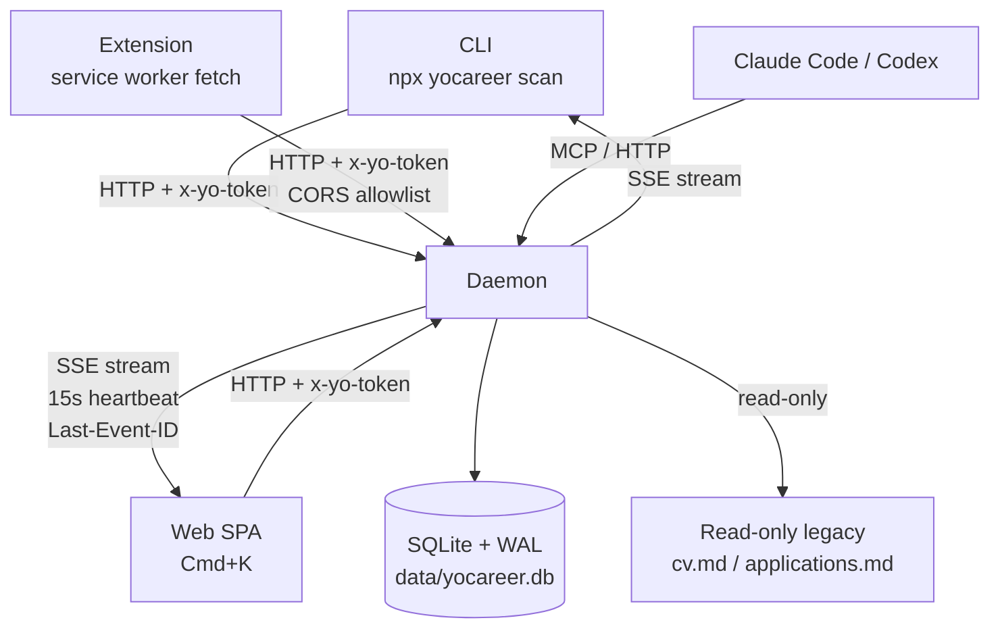
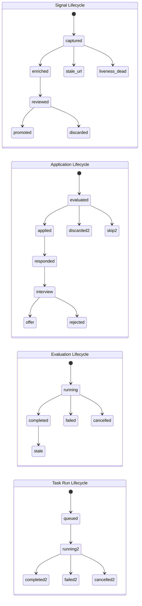

# yoCareer v2 重构：Web app + CLI 混合架构

## Summary

通过 9 个 implementation units 实施 v2 重构：底层引入 SQLite (better-sqlite3 v12.x) + 单一 schema 替代散落的 yaml/markdown/tsv；中层启动 localhost Node daemon 暴露 REST + SSE，CLI/Web/扩展/agent 四客户端通过 per-install token 平等访问；顶层重写 Web UI 为 vanilla `<dialog>` Cmd+K 面板 + Mirofish dark-first 大编号呈现，并新增 Manifest V3 浏览器扩展支持 BOSS/拉勾/智联/内推/微信文章 5 类页面。坚持现有零构建工具哲学（不引入 Vite/React/TypeScript），新增 `better-sqlite3` 和 `fuse.js` 两个 runtime deps。

---

## Problem Frame

origin 文档 (`docs/brainstorms/2026-05-09-yocareer-v2-refactor-requirements.md`) 已建立产品边界：CLI 门槛 / 数据散乱 / 国内市场覆盖不足三类痛点导致增量优化失效，必须彻底重构。本 plan 仅承担 HOW——技术选型、依赖关系、实施顺序、状态机设计、迁移策略。

---

## Requirements

本 plan 全量承接 origin 的 R1-R29，按主题分组：

**数据层 (R1-R5):** SQLite + WAL + JSON Schema + as_of 时间字段 + 报告即查询投影 + 老 markdown 数据保留只读不迁移

**流程编排 (R6-R8):** 5 阶段为描述性参考非强约束 + 显式状态机 + 14 modes 降级为内部能力

**浏览器扩展 (R9-R13):** 5 类平台首发 + 一键保存 + AI 表单 HITL + 招聘官信号 + 永不自动提交 + 零本地存储 + native messaging 或 localhost HTTP

**双客户端架构 (R14-R18):** 本地 Node daemon REST + SSE + 四客户端平等 + CLI 保持原命令名 + Web 是 Cmd+K 面板 + 模块卡片视图 + SSE 长任务进度

**国内市场边界硬化 (R19-R23):** 物理删除 modes/de/fr/ja/en + 海外字段 + capabilities.yml + 三道边界字段 + 招聘官公开活跃度

**Mirofish 设计契约 (R24-R29):** dark-first + 字体栈 + 大编号步骤呈现 + 暗灰圆角卡片 + 黑白人物插画 hero + design tokens 单一文件

**Origin actors:** A1 (求职用户), A2 (本地 daemon), A3 (Web 客户端), A4 (CLI 客户端), A5 (浏览器扩展), A6 (AI Agent)
**Origin flows:** F1 (用户数据采集与画像), F2 (从招聘平台保存岗位), F3 (岗位评估), F4 (CV 改动触发下游 stale), F5 (AI 表单填写 HITL)
**Origin acceptance examples:** AE1 (covers R7, R8), AE2 (covers R10, R11), AE3 (covers R23), AE4 (covers R15, R16, R18), AE5 (covers R3), AE6 (covers R12, R13)

---

## Scope Boundaries

- 不做 Sentinel 自动投递 / 任何不审核就发的功能（违反伦理）
- 不做多语言模式（modes/{de,fr,ja,pt,ru} 物理删除）
- 不做海外字段（visa_status / 13e mois / 13. Monatsgehalt / Tarifvertrag / Probezeit / 賞与 / overseas comp）
- 不做移动端优先形态
- 不做 Electron / Tauri 桌面壳
- 不做围墙平台账号自动登录 / CAPTCHA 绕过 / 批量私信
- 不做全球市场扩展
- 不做 v1 数据迁移工具（fresh start 替代）
- 不强制五阶段流程结构
- 不做 multi-process daemon / worker threads（单 SQLite 文件单写者）
- 不引入 HTTPS / TLS（localhost only）
- 不引入 WebSocket（SSE 足够）
- 不引入 HTTP/2 / HTTP/3（loopback 无收益）
- 不引入 native messaging（CN Chromium 浏览器分发死路）
- 不引入 Vite / React / TypeScript / 其他构建工具（违反零构建哲学）
- 不引入 Litestream / 自动云备份（仅文档化 `VACUUM INTO`）
- 不使用 `node:sqlite`（stability 1.1，等 Node 22+ 稳定后再迁移）
- 不自动检测/迁移 Cloud sync 路径下的 SQLite（仅警告）
- 不重新引入多语言 modes（v1.5+ 后才能讨论）

### Deferred to Follow-Up Work

- BOSS 私信 / 拉勾在线聊天 等扩展场景：v1.5 单独 PR
- Firefox / Safari 扩展支持：v1.5（v1 仅 Chromium）
- 黑白人物插画 hero 最终素材：v1 用占位符 SVG，最终设计师交付后单独 PR
- `node:sqlite` 迁移：等 Node 22+ 稳定后单独 PR
- Litestream / 云备份集成：仅当用户明确需要后单独 evaluate
- Dashboard Go TUI deprecation：origin 未要求；如 v2 上线后实测 TUI 用户量过低，单独 RFC 讨论
- docs/solutions/ 首批 compound learnings：origin R1-R29 未要求；v2 ship + 30 天观察期之后从实际 incident/PR 中沉淀，避免无的放矢

---

## Context & Research

### Relevant Code and Patterns

- `web-ui/server.mjs` (256 LOC) — 现有 127.0.0.1-only Node http server，是 daemon 的安全模式 precedent（regex allowlist + path-traversal guard + flushHeaders 模式）
- `lib/sanitize.mjs` — TSV/markdown 字段清洗，daemon 写入路径需保留作为显示层防御
- `lib/status-schema.mjs` + `templates/states.yml` — canonical state schema 的现有实现，是 4 个状态机 schema 的模板
- `bridges/pdf-extract.mjs` — 现有 PDF 入站桥，写 signals.ndjson，需改为 daemon HTTP upsert
- `templates/cv-system/{themes,layouts,components,checklist}.md` — guizang-style 4 文件矩阵，design tokens 直接复用
- `tests/risk-tiers-selftest.mjs` — JSON-out / exit-0|1 测试 pattern，新 test sections 沿用
- `update-system.mjs` — DATA_CONTRACT.md 的 user/system layer 实现，需扩展识别 `data/yocareer.db`

### Institutional Learnings

- Default to "what already exists" before introducing frameworks（learnings #2）—— web-ui 是 vanilla 零依赖 precedent
- Walled-platform automation = banned（China-First Provider learning）—— 扩展必须是用户 driven save，不漂向自动翻页
- 不要预加 fields like `weight` for future flexibility（risk-tiers PR #26 警告）—— event_log 同表 JSON 字段而非独立事件表
- CI hard-fail 而非 skip-on-missing-tool（PR #25）—— 新增 test sections 继承此 pattern
- Multi-CLI mirror 由 test-all.mjs section 9 enforced —— 删除 modes/{de,fr,ja,pt,ru} 不破坏 routing，但需 prune AGENTS.md/SKILL.md/DATA_CONTRACT.md 引用

### External References

- [better-sqlite3 v12.9.0](https://github.com/WiseLibs/better-sqlite3) — Node 20/22 LTS，SQLite 3.51.3，prebuild-install
- [Chrome Manifest V3](https://developer.chrome.com/docs/extensions/reference/manifest) — `host_permissions: ["http://127.0.0.1:*/*"]` 合法，service worker 30s idle 风险
- [WHATWG SSE §9.2](https://html.spec.whatwg.org/multipage/server-sent-events.html) — Last-Event-ID + retry frame
- [Node 20 stdlib http SSE](https://nodejs.org/docs/latest-v20.x/api/http.html) — `flushHeaders()` + `req.on('close')` 清理
- [W3C ARIA APG Combobox pattern](https://www.w3.org/WAI/ARIA/apg/patterns/combobox/) — Cmd+K 实现规范
- [Fuse.js](https://www.fusejs.io/) — 12KB minified，单 dep，vanilla-friendly
- [极简插件商店](https://chrome.zzzmh.cn/) + [Crx搜搜](https://www.crxsoso.com/) + Edge Add-ons — CN Chromium 扩展分发渠道

---

## Key Technical Decisions

- **SQLite driver = better-sqlite3 v12.x（不是 node:sqlite）：** Node 20 LTS 支持下界，stability 2.0，prebuild-install 节省 npm ci，与 Playwright 共用 native bindings 哲学
- **Daemon transport = localhost HTTP + per-install token + 6 位 pairing code（不是 native messaging）：** CN Chromium 多浏览器分发现实下，native messaging 安装路径碎片化（360 / QQ / 搜狗 / 极简插件商店都不同），且 Edge Add-ons 是 v1 主分发店，HTTP fetch 是唯一可移植路径
- **CORS + auth = `x-yo-token` header + pairing 围栏 + 启动时白名单：** 防御任何 BOSS/拉勾域内恶意页面 fetch localhost daemon 的 CSRF；token 写在 `~/.yocareer/daemon.json`（mode 0600）；扩展 install 时**必须**通过 6 位 pairing code 校验（POST /api/extension/pair）才能调 /register 拿 token，阻止任意 chrome-extension://* 域恶意扩展直接拿权限
- **Web 框架 = vanilla（不是 Vite/React/TypeScript）：** 现有 web-ui 已是 vanilla 零依赖，引入构建工具违反 stack discipline；50 个 Cmd+K 命令 vanilla `<dialog>` + Fuse.js 完全够用
- **Cmd+K 库选型 = Fuse.js（不是 cmdk/kbar）：** cmdk 强制 React migration（50KB+ 运行时），kbar 同；Fuse.js 12KB 单 dep，配 vanilla `<dialog>` + ARIA combobox 模式 ~150 LOC
- **event_log 存储 = 同表 JSON 字段（不是独立事件表）：** risk-tiers learning 警告"不预加 fields"；同表 JSON 查询性能足够（用户级数据规模），独立事件表过早抽象
- **CV 版本模型 = 版本化行 + FK：** 解决 G2 歧义，每次 CV 编辑产生新 cv_version 行，evaluations 表带 `cv_version_id` 外键；F4 stale propagation 是 whole-CV 粒度（per-section 复杂度收益不值）
- **Stale propagation = explicit DAG：** 5 输入实体 × 3 输出实体 = 15 invalidation rules 显式表达；每条 mutation 触发对应规则；客户端 UI 显示 stale 徽章
- **Long-task = task_run 表 + cooperative checkpoint：** 每个长任务（scan / batch / multi-step eval）创建 task_run 行，状态机 running → completed/failed/cancelled；客户端断开不停止 server-side（除非显式 cancel）；LLM call 之间检查 cancellation flag
- **Optimistic concurrency = `as_of` token：** 每个 mutating endpoint 接 `If-Match: <as_of>` header；冲突返回 HTTP 409；解决 G4 多客户端写竞争
- **Daemon discovery = `~/.yocareer/daemon.json`：** 启动时写入，所有客户端读取（port + UUID token + pairing_code + pairing_expires_at + db_path + version + started_at）；端口冲突 fallback 到下一可用端口
- **Daemon 启动方式 = npm script + detached fork（`npx yocareer daemon start`）：** 不引入 launchd/systemd 复杂度；用户在 v1 升级时手动启动；CLI 子命令同时也支持 `daemon stop/status/restart`；CLI 触发自动 fork 用 `spawn(..., {detached:true, stdio:['ignore', logFd, errFd]}).unref()` 保证关终端不杀 daemon
- **Daemon 默认端口 = 8650（不是 8643）：** AGENTS.md 已记录 Aditly bridge 用 8643，避免双服务并存时冲突；冲突仍 +1 fallback；CLI/SPA/扩展均从 daemon.json 读端口而非硬编码
- **SSE 实现 = stdlib http + 15s heartbeat + Last-Event-ID + ticket-based 鉴权：** 不引入 Express/Fastify；`X-Accel-Buffering: no` + `Cache-Control: no-transform` 防中间代理 buffering；`EventSource` API 不支持自定义 header，所以走"POST /api/events/ticket（带 x-yo-token）→ 拿 30s ticket → EventSource(?ticket=…)"两步流程，连接建立后 daemon 立刻 invalidate ticket
- **状态机 = 4 个独立 yaml schema：** signal lifecycle / application lifecycle / evaluation lifecycle / task_run lifecycle，分别在 `templates/states.{signals,applications,evaluations,task-runs}.yml`，由 `lib/status-schema.mjs` 加载（已有 schema loader 复用）
- **Dashboard Go TUI 决策 = 保留（origin 未要求弃用）：** dashboard/ 在 v2 中作为 Web UI 之外的另一个客户端继续工作，调用 daemon REST/SSE 与其他客户端等价；如未来用户量持续低 + 维护成本过高，再单独发起 deprecation RFC（不在本 plan scope）
- **多语言删除范围：** modes/{de,fr,ja,pt,ru}/ 26 文件 + 5 多语言 README + AGENTS.md/SKILL.md Language Modes 段 + DATA_CONTRACT.md System Layer 表中相关行 + lib/status-schema.mjs Spanish aliases + test-all.mjs allowedFiles whitelist
- **v1 upgrade detection = sentinel files：** 启动时检测 `cv.md` + `data/applications.md` 同时存在 → daemon 显示横幅 "v1 data detected (read-only). View archive | Start fresh."；不违反 R5 fresh-start

---

## Open Questions

### Resolved During Planning

- **Web 框架选型 (R14, R17):** 解决为 vanilla（继承现有 stack）+ Fuse.js（fuzzy match 唯一新 dep）
- **Daemon 启动方式 (R14):** 解决为 npm script + `~/.yocareer/daemon.json` 服务发现（不引入系统服务）
- **扩展通信协议 (R12, R13):** 解决为 localhost HTTP + `x-yo-token` 认证（不用 native messaging）
- **event_log 存储 (R3):** 解决为同表 JSON 字段（risk-tiers 警告下不过度抽象）
- **设计 tokens 格式 (R29):** 解决为 CSS custom properties（vanilla 一致）
- **状态机 stage 命名 (R7):** 解决为 4 个独立 yaml schema，详见 U1
- **modes 删除与 agentskills.io 协调 (R19-R20):** 解决为单 SKILL.md 源不变，仅 prune 多语言部分
- **G1 信号生命周期 states:** 解决为 `captured → enriched → reviewed → promoted → discarded`（外加 `stale_url / liveness_dead`）
- **G2 CV 版本模型:** 解决为版本化行 + FK 到 evaluations.cv_version_id
- **G3 Stale propagation graph:** 解决为显式 DAG（5×3 = 15 rules，详见 U1）
- **G4 并发写冲突:** 解决为 `as_of` optimistic token + HTTP 409
- **G5 Daemon discovery:** 解决为 `~/.yocareer/daemon.json` + `/healthz` endpoint
- **G6 Long-task interruption:** 解决为 task_run 表 + cooperative checkpoint
- **G7 v1 upgrade UX:** 解决为 sentinel detection + read-only banner
- **G8 CSRF 攻击面:** 解决为 per-install UUID token + `x-yo-token` header + 首次安装 pairing code（详见 U2/U7）
- **G9 Empty-state policy:** 解决为 1 行文本 + Cmd+K 提示，不要插画
- **G10 form_draft provenance:** 表单 AI 自动填写时，每个字段写一行 `form_drafts(field_id, value, source: "ai"|"user", filled_at)`；用户提交时记 `user_confirmed_at`；submit 永久禁用直到 "我已审核" checkbox 勾选（详见 U7）

### Deferred to Implementation

- 黑白人物插画 hero 最终素材：v1 占位符 SVG，最终设计师交付时再替换
- BOSS 私信 / 拉勾在线聊天 抓取强度阈值 (R23)：[Needs research] v1 仅扫公开主页，超出强度阈值的方案需要法务过；ce-work 阶段 reviewer 决策
- 扩展 install 时的 token 拉取 UX 细节（用户首次打开扩展看到什么）：[Technical] 扩展 onInstall 触发，UI 文案推迟到实现
- 多浏览器 manifest.json 差异调试（360 / QQ / 搜狗 实际兼容性）：[Needs research] ce-work 阶段实测
- `信息密度 > 60%` 的具体测量算法（视觉占用 / 像素 / 信息熵）：[Technical] 推迟到 design lint 实现时定义
- SQLite 文件被云盘同步（Dropbox/iCloud/坚果云/OneDrive）的 refuse-to-open 检测路径列表：[Technical] 推迟到 daemon startup 实现

---

## Output Structure

```
yoCareer/
├── data/
│   └── yocareer.db                 # NEW user-layer SQLite (添加到 DATA_CONTRACT)
├── db/                             # NEW
│   ├── schema/
│   │   ├── 0001_init.sql
│   │   ├── 0002_add_*.sql
│   │   └── README.md
│   └── migrations.mjs              # hand-rolled user_version PRAGMA runner
├── daemon/                         # NEW
│   ├── server.mjs                  # 主入口；Node http + SSE
│   ├── routes/
│   │   ├── api-profile.mjs
│   │   ├── api-signals.mjs
│   │   ├── api-evaluations.mjs
│   │   ├── api-applications.mjs
│   │   ├── api-tasks.mjs
│   │   ├── api-extension.mjs       # 扩展 register / token 颁发
│   │   └── api-events.mjs          # SSE
│   ├── lib/
│   │   ├── auth.mjs                # x-yo-token 校验
│   │   ├── cors.mjs                # 启动时白名单
│   │   ├── broadcast.mjs           # SSE manager + ring buffer
│   │   ├── concurrency.mjs         # as_of optimistic
│   │   ├── stale-propagation.mjs   # DAG executor
│   │   └── state-machines.mjs      # 4 个状态机 transition runner
│   └── README.md
├── extension/                      # NEW Manifest V3 浏览器扩展
│   ├── manifest.json
│   ├── sw.js                       # service worker
│   ├── content/
│   │   ├── boss.js
│   │   ├── lagou.js
│   │   ├── zhaopin.js
│   │   ├── referral-link.js
│   │   └── wechat-article.js
│   ├── popup/
│   │   ├── popup.html
│   │   ├── popup.js
│   │   └── popup.css
│   ├── form-fill/                  # AI 表单填写 HITL
│   │   ├── fill.js
│   │   └── form-draft.js
│   └── README.md
├── web-ui/                         # 重写
│   ├── server.mjs                  # 改为 daemon API 客户端的反代（或废弃，由 daemon 直接 serve）
│   ├── index.html
│   ├── main.js                     # 重写：Cmd+K + 模块卡片 + SSE 客户端
│   ├── cmdk.js                     # vanilla <dialog> + ARIA combobox + Fuse.js
│   ├── modules/                    # 5 个模块（按实际功能划分）
│   │   ├── profile.js
│   │   ├── portals.js
│   │   ├── signals.js
│   │   ├── evaluations.js
│   │   └── reports.js
│   ├── styles.css                  # 重写：CSS custom properties + Mirofish tokens
│   ├── tokens.css                  # design tokens 单一文件
│   └── assets/
│       └── hero-placeholder.svg
├── templates/
│   ├── capabilities.yml            # NEW 平台能力矩阵
│   ├── states.signals.yml          # NEW
│   ├── states.applications.yml     # 现有 states.yml 拆分
│   ├── states.evaluations.yml      # NEW
│   └── states.task-runs.yml        # NEW
├── lib/                            # 现有共享 utils 保留 + 扩展
│   ├── bridge-runner.mjs           # 保留
│   ├── mcp-client.mjs              # 保留
│   ├── sanitize.mjs                # 保留（daemon 写入复用）
│   ├── status-schema.mjs           # 修改：加载多个 states.*.yml
│   └── daemon-client.mjs           # NEW CLI 用 HTTP 客户端
├── tests/
│   ├── sqlite-schema-selftest.mjs  # NEW
│   ├── daemon-rest-selftest.mjs    # NEW
│   ├── daemon-sse-selftest.mjs     # NEW
│   ├── extension-manifest-selftest.mjs  # NEW
│   ├── capabilities-selftest.mjs   # NEW
│   └── v1-upgrade-detection-selftest.mjs  # NEW
├── modes/                          # 现有保留 + 删除多语言
│   ├── _shared.md
│   ├── _profile.template.md
│   ├── *.md (20 个 mode files 保留)
│   └── zh-cn/                      # 保留
├── (DELETED) modes/de/             # R19 删除
├── (DELETED) modes/fr/
├── (DELETED) modes/ja/
├── (DELETED) modes/pt/
├── (DELETED) modes/ru/
├── dashboard/                      # 保留：Go TUI 仍作为客户端调 daemon REST/SSE
├── (DELETED) README.es.md
├── (DELETED) README.ja.md
├── (DELETED) README.ko-KR.md
├── (DELETED) README.pt-BR.md
├── (DELETED) README.ru.md
└── docs/
    └── solutions/
        └── README.md               # 索引占位（首批 learning 文档推迟到 ship 后 30 天）
```

---

## High-Level Technical Design

> *This illustrates the intended approach and is directional guidance for review, not implementation specification. The implementing agent should treat it as context, not code to reproduce.*

### 客户端 - Daemon 通信 (mermaid)



### 状态机 + 失效传播



### Stale Propagation DAG（部分示例）

```
cv_version 修改 → 所有引用此 cv_version_id 的 evaluation → stale=true
profile.target_roles 修改 → 所有 signal.fit_score → recompute_required=true
portals.yml 修改 → 下次 scan 自动 invalidate signals 列表
risk-tiers.yml 修改 → 所有 evaluation.legitimacy_score → stale=true
capabilities.yml 修改 → 不 invalidate 历史数据，仅影响新扫描
```

### SSE 协议（伪代码）

```
# Step 1: 客户端用 x-yo-token 换取一次性 SSE ticket（短时 30s 有效）
POST /api/events/ticket
Headers:
  x-yo-token: <UUID>

Response:
  HTTP/1.1 200 OK
  Content-Type: application/json
  { "ticket": "<UUID>", "expires_in": 30 }

# Step 2: 用 ticket 走 EventSource（浏览器 EventSource 无法注入自定义 header，
# 所以走 query string；ticket 一次性，daemon 收到后立刻 invalidate）
GET /api/events?ticket=<UUID>
Headers:
  Accept: text/event-stream
  Last-Event-ID: <optional>

Response:
  HTTP/1.1 200 OK
  Content-Type: text/event-stream
  Cache-Control: no-cache, no-transform
  Connection: keep-alive
  X-Accel-Buffering: no

  retry: 5000\n\n
  : keepalive\n\n        # 每 15s
  id: 42\n
  event: task.progress\n
  data: {"task_id":"...","progress":0.7,"message":"Evaluating offer 7/10"}\n\n
```

---

## Implementation Units

### U1. SQLite foundation + schema + state machines + stale propagation DAG

**Goal:** 建立 SQLite 数据层作为整个 daemon 的底盘；定义 8 个核心实体的 schema、4 个状态机的 transition rules、5×3 stale propagation DAG。这是其他所有 unit 的依赖，必须最先完成。

**Requirements:** R1, R2, R3, R4, R5, R7（+ 解决 G1, G2, G3, G6）

**Dependencies:** None（first unit）

**Files:**
- Create: `db/schema/0001_init.sql`（8 个实体表 + 索引）
- Create: `db/schema/README.md`（schema 演化规则、user_version 约定）
- Create: `db/migrations.mjs`（hand-rolled `PRAGMA user_version` runner，~30 LOC）
- Create: `templates/states.signals.yml`、`templates/states.evaluations.yml`、`templates/states.task-runs.yml`
- Modify: `templates/states.yml` → `templates/states.applications.yml`（重命名 + 删除 Spanish aliases）
- Modify: `lib/status-schema.mjs`（支持加载多个 states.*.yml + 删除 FALLBACK_STATES Spanish aliases）
- Create: `daemon/lib/state-machines.mjs`（4 个状态机的 transition runner + invalid-transition 检测）
- Create: `daemon/lib/stale-propagation.mjs`（DAG executor：mutation → 触发 invalidation rules）
- Test: `tests/sqlite-schema-selftest.mjs`（schema 创建、迁移可重入、状态机合法转移）

**Approach:**
- 8 个核心实体表：`profile / portals / capabilities / cv_versions / signals / applications / evaluations / task_runs`
- 每条记录带 `id (UUID) / created_at / as_of / event_log (JSON) / current_status (FK to states yaml)`
- `evaluations` 带 `cv_version_id` FK，CV 修改产生新 cv_version 行，旧 evaluation 自动标 stale=true（whole-CV 粒度）
- 状态机 transition table 在 yaml 中定义（参考 templates/states.yml 现有格式），转移时 daemon 验证合法性
- Stale propagation DAG 显式列出 15 条 invalidation rules（5 输入实体 × 3 输出实体）
- WAL pragmas: `journal_mode = WAL / synchronous = NORMAL / foreign_keys = ON / busy_timeout = 5000 / temp_store = MEMORY / mmap_size = 134217728 / cache_size = -65536`
- 启动时检测 SQLite 文件路径是否在云同步盘（Dropbox / iCloud / 坚果云 / OneDrive），命中则 refuse to open 并提示用户改路径

**Patterns to follow:**
- `lib/status-schema.mjs` 现有 yaml schema loader 模式
- `tests/risk-tiers-selftest.mjs` 现有 yaml validation pattern
- PR #26 risk-tiers learning：不预加 fields like `weight` for future flexibility

**Test scenarios:**
- Happy path: 全新 db 路径 → migrations.mjs 创建 schema 0001 → user_version=1
- Edge case: 已有 schema 0001 + 0002 pending → 仅 apply 0002 → user_version=2
- Edge case: schema 倒退（用户回退 v2 → v1）→ migrations.mjs 拒绝 downgrade，错误退出
- Edge case: SQLite 路径在 Dropbox 文件夹 → daemon 启动 refuse to open + 错误信息
- Error path: 状态机非法转移（如 `signals: discarded → captured`）→ throw `INVALID_TRANSITION` 错误，事务回滚
- Integration: 修改一个 cv_version → stale-propagation 触发 → 所有 evaluations.cv_version_id=旧 ID 的行 stale=true（验证 SQL view 实时反映）
- Integration: 4 个独立状态机各自 yaml 加载 → status-schema.mjs 返回 4 个 schema 对象 → daemon API 校验各自 transition

**Verification:**
- `node tests/sqlite-schema-selftest.mjs` exit 0（U9 后会接入 test-all.mjs section 16）
- migrations 可重入（执行两次不重复创建 table）
- 4 个状态机各自的合法转移路径在 selftest 中全部覆盖
- 15 条 stale propagation rules 在测试中至少各触发一次

---

### U2. Daemon HTTP server + token auth + CORS + SSE broadcast

**Goal:** 启动 localhost-only Node http daemon，暴露 REST + SSE，建立 per-install token 认证 + CORS allowlist 安全模型。

**Requirements:** R12, R13, R14, R15, R18, R22（+ 解决 G5, G8）

**Dependencies:** U1（需要 SQLite + state machines）

**Files:**
- Create: `daemon/server.mjs`（Node http + 路由分发 + 启动时写 `~/.yocareer/daemon.json`）
- Create: `daemon/lib/auth.mjs`（`x-yo-token` 校验中间件 + `/api/extension/register` 颁发）
- Create: `daemon/lib/cors.mjs`（启动时白名单：扩展 ID + Web 的 chrome-extension://）
- Create: `daemon/lib/broadcast.mjs`（SSE manager：Map<id, {res, lastSeen, lastEventId}> + 15s heartbeat + ring buffer 100 events）
- Create: `daemon/lib/concurrency.mjs`（`as_of` token 校验，冲突返回 409）
- Create: `daemon/routes/api-events.mjs`（GET /api/events SSE endpoint，鉴权走 `?ticket=<UUID>` 一次性 ticket）
- Create: `daemon/routes/api-events-ticket.mjs`（POST /api/events/ticket 颁发短时 ticket：x-yo-token → 30s 有效 UUID）
- Create: `daemon/lib/ticket-store.mjs`（in-memory `Map<ticket, {expires_at}>`，连接建立后 invalidate；空闲 30s 自动清理）
- Create: `daemon/routes/api-health.mjs`（GET /healthz: `{version, db_path, started_at, db_user_version}`）
- Create: `daemon/routes/api-extension.mjs`（POST /api/extension/register 颁发 token；POST /api/extension/pair 校验 6 位 pairing code）
- Create: `daemon/lib/pairing.mjs`（启动时生成 6 位 pairing code 写入 daemon.json + 终端打印；扩展首次 register 必须先 /pair）
- Test: `tests/daemon-rest-selftest.mjs`、`tests/daemon-sse-selftest.mjs`

**Approach:**
- 启动流程：(1) 检查 `~/.yocareer/daemon.json` 是否已存在且端口可达 → 已运行则退出（一份实例）；(2) 选端口（默认 **8650**，冲突则 +1 重试。**注意：8643 已被 Aditly bridge 占用，避开**）；(3) 生成 UUID token；(4) 生成 6 位数字 pairing code；(5) 写 `~/.yocareer/daemon.json`（mode 0600，含 `port / token / pairing_code / pairing_expires_at`）+ 终端打印 pairing code；(6) 监听 127.0.0.1:port
- Auth 中间件：所有 mutating endpoint 必须带 `x-yo-token` header；`/healthz` 公开（不带 token）；405 GET-only 沿用现有 web-ui pattern 但改为允许 POST/PUT/DELETE
- SSE 鉴权（critical）：`EventSource` API 不支持自定义 header，所以不能在 `/api/events` 上要求 `x-yo-token`。改为两步：(1) 客户端先 POST `/api/events/ticket`（带 `x-yo-token`）→ daemon 返回 30s 有效的 UUID ticket；(2) 客户端 `new EventSource('/api/events?ticket=<UUID>')` → daemon 从 query string 取 ticket → ticket-store 校验 + invalidate；连接断开后客户端要重新申请 ticket
- 扩展 pairing 流程（critical）：`POST /api/extension/register` **必须**先经过 `POST /api/extension/pair`。Pair 端点要求请求体带 `{pairing_code: "123456"}` 与 daemon 启动时生成的 code 比对，匹配才回 token；pairing code 一次性使用且 24h 过期；首次安装失败的用户从终端日志或 `npx yocareer daemon status` 取 code 重试。这道围栏阻止任意 chrome-extension://* 域恶意扩展直接拿 token
- CORS allowlist：固定允许 `chrome-extension://*`（pair 完成后绑定具体扩展 ID，daemon 写到运行时白名单）+ `http://127.0.0.1:port` 自身
- SSE broadcast：每个连接进 Map，15s 写 `: keepalive\n\n`，事件用 `id: N\nevent: <name>\ndata: <json>\n\n` 格式；维护 ring buffer 100 events 支持 Last-Event-ID 重连
- Optimistic concurrency：mutating endpoint 接 `If-Match: <as_of>` header，比对 db 中当前 as_of 不一致返回 409
- Graceful shutdown：SIGTERM/SIGINT 时关闭所有 SSE 连接，关闭 SQLite，删除 `~/.yocareer/daemon.json`

**Execution note:** 实现顺序 = `daemon.json` 写入 → auth/CORS → REST 路由骨架 → SSE → optimistic concurrency。每一层先单元测过再叠下一层。

**Patterns to follow:**
- `web-ui/server.mjs` 现有 127.0.0.1 binding + path-traversal 防御 + `decodeURIComponent` 包装
- `lib/sanitize.mjs` 写入路径所有字段经过 sanitize
- Framework docs research 给的 SSE 模板（`flushHeaders` + `req.on('close')` + `X-Accel-Buffering: no`）

**Test scenarios:**
- Happy path: daemon 启动 → `/healthz` 返回 200 + `{version, db_path, ...}` + 终端打印 6 位 pairing code
- Happy path: 扩展 POST /api/extension/pair 带正确 pairing_code → daemon 颁发 UUID token
- Happy path: 客户端 POST /api/events/ticket 带 token → 收到 30s ticket → EventSource(?ticket=…) → 收到 `retry: 5000` → 15s 内收到 keepalive → daemon 广播事件 → 客户端收到
- Edge case: 已有 daemon 在运行 → 启动新实例检测到 → 退出 + 日志提示
- Edge case: 端口 8650 被占 → daemon 退到 8651
- Edge case: 8643 被 Aditly bridge 占用 → daemon 仍走 8650 → 两服务并存不冲突
- Edge case: pairing_code 错误 / 已过期 → POST /api/extension/pair 回 403 + 提示从 `npx yocareer daemon status` 取新 code
- Edge case: SSE ticket 过期（>30s 未连接）→ EventSource 收到 401 → 客户端重新申请 ticket
- Edge case: SSE ticket 重用（同一 ticket 第二次连接）→ 第二次回 401 + ticket-store 已 invalidate
- Error path: mutating endpoint 不带 `x-yo-token` → 401
- Error path: `x-yo-token` 错误 → 403
- Error path: 直接 GET /api/events 无 ticket → 401
- Error path: CORS Origin 不在 allowlist → 403
- Error path: SSE 客户端断开 → `req.on('close')` 触发 → Map 中清理
- Edge case: SSE 重连带 `Last-Event-ID: 39` → 服务端从 ring buffer 重发 40-50 事件
- Integration: `/api/profile` PUT 带过期 `If-Match` → 409 + 返回当前 as_of
- Security: 恶意 chrome-extension://* 域直接 POST /api/extension/register（跳过 pair）→ 403

**Verification:**
- `node tests/daemon-rest-selftest.mjs` exit 0（4 endpoints；U9 接入 test-all.mjs section 17）
- `node tests/daemon-sse-selftest.mjs` exit 0（heartbeat + reconnect + Last-Event-ID；U9 接入 section 18）
- `~/.yocareer/daemon.json` 在启动后存在，shutdown 后删除
- 端口冲突场景手动测试通过

---

### U3. Domain layer + REST endpoints + task_run coordination

**Goal:** 在 daemon 上实现 6 个核心实体的 REST API（profile / portals / signals / applications / evaluations / cv_versions），加上 task_run cooperative checkpoint，as_of optimistic concurrency 全面集成。

**Requirements:** R6, R7, R8, R14, R18（+ 解决 G4, G6）

**Dependencies:** U1, U2

**Files:**
- Create: `daemon/routes/api-profile.mjs`（GET / PUT，as_of 校验）
- Create: `daemon/routes/api-portals.mjs`
- Create: `daemon/routes/api-signals.mjs`（GET 列表 / POST upsert / PATCH 状态转移 / DELETE）
- Create: `daemon/routes/api-applications.mjs`
- Create: `daemon/routes/api-evaluations.mjs`（POST 触发评估 → 返回 task_id；GET /api/evaluations/:id）
- Create: `daemon/routes/api-cv-versions.mjs`（GET / POST 新版本）
- Create: `daemon/routes/api-tasks.mjs`（GET /api/tasks/:id/status；POST /api/tasks/:id/cancel）
- Create: `daemon/lib/task-runner.mjs`（task_run 表 + cooperative checkpoint between LLM calls）
- Modify: `bridges/pdf-extract.mjs`（写 signals 改为 daemon HTTP upsert）
- Test: `tests/daemon-rest-selftest.mjs` 扩展（每个 endpoint 的 happy/error path）

**Approach:**
- 每个 mutating endpoint 包装在 SQLite transaction 中
- 触发 stale propagation：mutation 完成后调用 `stale-propagation.mjs` 的 `invalidate(entity, id)` → 自动更新下游实体 stale=true 列
- 长任务（scan / batch / multi-step eval）：daemon 创建 task_run 行 → 返回 task_id 给客户端 → 后台 cooperative checkpoint 间检查 task_run.cancellation_requested=true → 是则中止 + 标 cancelled
- 客户端断开（SSE close 或 HTTP 请求超时）不停止 server-side task；用户必须显式 cancel
- task_run 进度通过 SSE 事件 `task.progress` 推送（带 task_id + percentage + message）

**Patterns to follow:**
- `lib/sanitize.mjs` 所有写入字段经 sanitize
- `lib/status-schema.mjs` 状态转移调用 `state-machines.mjs::transition()`
- Spec flow analyzer G4: 每个 mutating endpoint 必须接 `If-Match` header

**Test scenarios:**
- Happy path: POST /api/signals + valid token + valid as_of → 201 + 新 signal id + SSE 广播 signal.created
- Happy path: PATCH /api/signals/:id status=promoted → 状态机校验合法 → 200 + 触发 application 创建
- Error path: PATCH 非法转移（discarded → captured）→ 400 + INVALID_TRANSITION
- Error path: PUT /api/cv-versions 旧 as_of → 409 + 当前 as_of
- Edge case: 触发 evaluation 创建 task_run → 客户端断开 SSE → task_run 继续运行 → 下次 SSE 重连仍能查 task 状态
- Integration: 修改 cv_version → stale-propagation 触发 → 所有 cv_version_id=旧 ID 的 evaluation 自动 stale=true → SSE 广播 evaluation.stale 事件
- Integration: POST /api/tasks/:id/cancel → task_runner 在下个 checkpoint 检测到 → status=cancelled + SSE 广播 task.cancelled

**Verification:**
- 6 个实体 CRUD 全部通过 selftest
- task_run cancel 在 LLM call 之间生效（人工注入 sleep 模拟长 LLM call）
- 修改 cv_version 后 SQL view 中 evaluation.stale 实时为 true
- Optimistic concurrency 冲突回 409，不破坏数据

---

### U4. CLI 薄封装迁移：所有 .mjs 改为 daemon HTTP 客户端

**Goal:** 把现有 14 个 `.mjs` 命令脚本改造为 daemon HTTP 薄封装，保留原命令名兼容老用户；新增 `daemon start/stop/status/restart` 子命令。

**Requirements:** R8, R15, R16

**Dependencies:** U1, U2, U3（CLI 调 daemon API）

**Files:**
- Create: `lib/daemon-client.mjs`（fetch wrapper：自动读 `~/.yocareer/daemon.json`，附 `x-yo-token`，处理 SSE）
- Create: `daemon-cli.mjs`（新顶层脚本：`daemon start|stop|status|restart`）
- Modify: `scan.mjs`（1140 LOC → 改为调 POST /api/scan + 监听 SSE task.progress）
- Modify: `merge-tracker.mjs`（改为 POST /api/applications/import 替代 markdown table 写入）
- Modify: `dedup-tracker.mjs`（改为调 daemon dedup 端点）
- Modify: `normalize-statuses.mjs`（改为调 daemon status normalization）
- Modify: `verify-pipeline.mjs`（改为调 daemon /api/verify）
- Modify: `generate-pdf.mjs`（输入数据从 SQLite，输出仍写 output/）
- Modify: `generate-latex.mjs`
- Modify: `analyze-patterns.mjs`、`followup-cadence.mjs`、`gemini-eval.mjs`、`model-health.mjs`
- Modify: `bridges/pdf-extract.mjs`（写入路径改 daemon API）
- Modify: `bridges/reach-read-url.mjs`、`bridges/reach-signal-search.mjs`
- Modify: `package.json`（新增 `daemon` script + 删除若干旧 npm scripts）
- Test: 现有 test-all.mjs section 2（script execution）扩展，验证所有 npm run X 在 daemon 启动状态下正常工作

**Approach:**
- `lib/daemon-client.mjs` 是统一接口：所有 .mjs 通过它调 daemon
- 启动前检测 `~/.yocareer/daemon.json` 不存在或 daemon 不响应 → 自动 `daemon start`（fork 子进程后台跑）+ 等待 5s → 仍失败则错误退出 + 提示用户手动 `npx yocareer daemon start`
- npm scripts 保持原命令名 100% 向后兼容（`npm run scan / pdf / sync-check / liveness` 等）
- `daemon-cli.mjs` 是新增子命令：start（fork）/ stop（PID kill）/ status（查 /healthz）/ restart
- 长任务（scan）：CLI 触发后 SSE 监听 task.progress，终端实时打印进度条；Ctrl+C 触发 task cancel

**Execution note:** 改造按"叶子节点向 root"——先迁移 generate-pdf / liveness 这种叶子，再迁移 scan / merge-tracker 这种 root。每个 .mjs 改完后立刻 npm run 它确保兼容。

**Patterns to follow:**
- `lib/bridge-runner.mjs` 现有 fetch + timeout 模式
- `lib/mcp-client.mjs` SSE 解析模式（已存在用于 Aditly bridge）

**Test scenarios:**
- Happy path: daemon 已启动 → `npm run scan` → daemon /api/scan POST → 收 SSE task.progress → 终端进度条更新 → 完成
- Happy path: daemon 未启动 → `npm run scan` → CLI 自动 fork daemon → 等待 healthz → 继续 scan
- Error path: daemon 启动失败（端口冲突无 fallback / SQLite 损坏）→ CLI 输出明确错误 + `npx yocareer daemon status` 提示
- Edge case: Ctrl+C 中断 scan → CLI 调 POST /api/tasks/:id/cancel → daemon 在下个 LLM checkpoint 中止 → CLI 终端打印 cancelled
- Integration: 4 个守门脚本（merge / dedup / normalize / verify）全部通过 daemon 工作 → applications.md 不再被 CLI 直接写
- Integration: `npm run pdf:import` 与 `npm run scan` 串联 → PDF 抽取 signals 写 SQLite → scan 读 SQLite signals

**Verification:**
- `npm run` 19 个 script 在 daemon 启动状态下全部 exit 0
- `daemon start/stop/status/restart` 4 个子命令工作正常
- 现有 batch/batch-runner.sh 不需修改即兼容
- 终端进度条流畅（SSE 15s heartbeat 保活）

---

### U5. Web SPA shell + Cmd+K palette + SSE client + 模块卡片视图

**Goal:** 重写 Web UI 为 Cmd+K 命令面板驱动的模块卡片 SPA。继承现有 vanilla 哲学，新增 Fuse.js 唯一 dep。

**Requirements:** R6, R8, R14, R17, R18（+ 解决 G9）

**Dependencies:** U2, U3（Web 调 daemon API + SSE）

**Files:**
- Modify: `web-ui/server.mjs`（改造为 daemon API 反代或直接由 daemon 静态 serve；倾向后者，删除现有 web-ui/server.mjs）
- Modify: `web-ui/index.html`（顶层 shell：Cmd+K 触发 + 模块切换 + SSE 状态指示）
- Rewrite: `web-ui/main.js`（新 ~200 LOC：路由 + Cmd+K 注入 + SSE 客户端 + 模块加载）
- Create: `web-ui/cmdk.js`（vanilla `<dialog>` + ARIA combobox + Fuse.js 实例 + 命令注册 API）
- Create: `web-ui/sse-client.js`（EventSource + fetch ReadableStream fallback + 重连 + Last-Event-ID）
- Create: `web-ui/modules/profile.js`、`portals.js`、`signals.js`、`evaluations.js`、`reports.js`（按实际功能模块划分，不强制 5 段）
- Create: `tests/web-ui-selftest.mjs`（headless DOM 校验 Cmd+K trigger + ARIA combobox + SSE 客户端 fetch+EventSource 流程）
- Modify: `package.json`（添加 `fuse.js` runtime dep）

**Approach:**
- Cmd+K 实现：vanilla `<dialog>` 自带 focus trap + Esc，input 是 `role="combobox"`，list 是 `role="listbox"`，箭头键移 `aria-activedescendant`，Enter 触发 command；Fuse.js 模糊匹配（threshold 0.4）
- 命令面板覆盖所有原 14 个 mode 的"动词+宾语"命令（如 `scan signals` / `evaluate signal #42` / `generate cv` / `apply`）
- SSE 客户端：标准 `EventSource` API + `?ticket=<UUID>` 一次性 ticket。流程：(1) `fetch('/api/events/ticket', {headers: {'x-yo-token': T}})` → 拿 30s ticket；(2) `new EventSource('/api/events?ticket=<UUID>')`；(3) 断线后 onerror 触发重新申请 ticket；(4) 维护 lastEventId 用于 reconnect
- 模块卡片视图：每个模块 1 个卡片或多个子卡片，按真实功能边界划分（不强制 5 个）；Mirofish 大编号样式由 U6 design tokens 注入
- 空状态策略：禁止插画 / hero banner / onboarding tour（R27）；用 1 行 prose + Cmd+K 提示（"按 Cmd+K 添加第一个 signal"）
- v1 升级横幅：检测到 SQLite 中 v1_archive_detected=true 时显示横幅 "v1 data detected (read-only). View archive | Start fresh"（U8 提供 detection 逻辑）

**Patterns to follow:**
- W3C ARIA APG combobox-with-listbox 模式
- 现有 web-ui/main.js 308 LOC 的 vanilla 风格
- Fuse.js fuzzy match 阈值经验

**Test scenarios:**
- Happy path: 加载 SPA → 默认显示 profile 模块 → 按 Cmd+K → dialog 打开 → 输入 "scan" → Fuse.js 匹配 → Enter → 触发 scan + SSE 进度
- Happy path: 长扫描运行中 → SSE 推 task.progress → SPA 显示进度条
- Edge case: 无数据时打开 signals 模块 → 显示 "No signals yet. Press ⌘K to add one."（不显示插画）
- Edge case: SSE 断线 → 重连 + Last-Event-ID 接续 → 不丢事件
- Error path: daemon /api/* 返回 401（token 失效）→ SPA 显示 "Daemon auth lost. Please restart yoCareer daemon."
- Integration: 编辑 cv → 提交 PUT /api/cv-versions → 收到 SSE evaluation.stale 广播 → 评估列表显示 stale 徽章
- Accessibility: VoiceOver 朗读 Cmd+K combobox 正确（announce role="combobox" + activedescendant 选项）

**Verification:**
- `node tests/web-ui-selftest.mjs` exit 0（含 Cmd+K 触发 + ARIA combobox + SSE；U9 接入 test-all.mjs section 19）
- 50 个命令在 Cmd+K 中模糊匹配延迟 < 50ms
- Lighthouse a11y 评分 ≥ 95
- SPA 总 KB（gzipped）≤ 50KB（Fuse.js 12KB + 自写代码）

---

### U6. Mirofish design contract + design tokens + 4 文件矩阵 + dark-first 视觉系统

**Goal:** 把 mirofish-demo.pages.dev 的视觉风格落地为 design tokens 单一文件，沿用项目已有的 guizang-style 4 文件矩阵；驱动 Web / PDF / CLI 输出统一。

**Requirements:** R24, R25, R26, R27, R28, R29

**Dependencies:** U5（design tokens 注入 web-ui）

**Files:**
- Create: `web-ui/tokens.css`（CSS custom properties：颜色 / 字号 / 间距 / 圆角 / 阴影 / 网格）
- Modify: `web-ui/styles.css`（重写为 token-driven，~200 LOC）
- Create: `templates/mirofish-system/themes.md`（dark / 暗灰背景配色清单 + 1-2 强调色规则）
- Create: `templates/mirofish-system/layouts.md`（大编号步骤呈现 / 模块卡片 / hero 区 layout 规范）
- Create: `templates/mirofish-system/components.md`（暗灰圆角卡片 / Cmd+K dialog / 进度条 / 状态徽章）
- Create: `templates/mirofish-system/checklist.md`（信息密度 KPI / 禁止 hero banner / onboarding tour / 空状态插画）
- Create: `web-ui/assets/hero-placeholder.svg`（黑白线条人物占位群像）
- Modify: `templates/cv-template.cn.html`（dark-first 配色 + 等宽数字）
- Modify: `templates/cv-template.cn.tex`（同上）
- Test: `tests/design-tokens-selftest.mjs`（tokens.css 字段完整性 + Web/PDF 共享 token 一致性）

**Approach:**
- design tokens 用 CSS custom properties（vanilla 一致）：`--color-bg / --color-surface / --color-text-primary / --color-text-secondary / --color-accent-1 / --color-accent-2 / --font-display / --font-body / --font-mono / --font-cursive / --space-{1-12} / --radius-{sm,md,lg} / --shadow-card`
- 字体栈：粗黑 sans-serif（Inter / Geist 自托管，不调 Google Fonts）+ 装饰性 cursive（Caveat 自托管，仅用于人情味 hero 文案）+ 等宽（JetBrains Mono）+ 思源黑体（CJK fallback）
- 步骤呈现：仿 mirofish-demo "Predict in N Steps"——大编号 01/02/...（48px 等宽数字）+ 标题（24px 粗黑）+ 副标题（14px 灰）+ 暗灰圆角卡片（16px radius + 1px subtle border）
- hero 区：placeholder.svg 是黑白线条人物群像（占位，最终素材推迟到 Deferred to Follow-Up）；仅在主页一处使用
- 信息密度 KPI：在 checklist.md 中定义为 "viewport 内首屏可识别决策密度 ≥ 60%"（具体测量算法 ce-work 阶段定）
- PDF 模板复用相同 tokens（将 CSS variables 转为 LaTeX 命令）

**Patterns to follow:**
- `templates/cv-system/{themes,layouts,components,checklist}.md` 现有 guizang-style 4 文件矩阵
- mirofish-demo.pages.dev 实际视觉规范（截图 + snapshot 已 documented）

**Test scenarios:**
- Happy path: Web SPA 加载 tokens.css → 全部 CSS variables 解析成功 → 主页显示 dark-first 风格
- Happy path: 切换 light theme（如未来支持）→ tokens.css 切换 → 全站颜色随 token 变化
- Edge case: 老浏览器不支持 CSS variables → fallback 到默认 dark 配色（不用 PostCSS 转换）
- Integration: PDF 模板生成 CV → 颜色 / 字号与 Web UI 一致（tokens 跨 surface 同步）
- Edge case: 信息密度低于 60% 的页面 → checklist 中 lint 标记为 P1

**Verification:**
- tokens.css 含 30+ CSS variables 全部命名规范
- 4 文件矩阵 documented 完整（参考 cv-system 结构）
- mirofish-demo 视觉对照度评分（人工对比）≥ 80%
- 设计师可凭 4 文件 + tokens 独立做新组件，不需问 dev

---

### U7. 浏览器扩展 (Manifest V3) + 5 平台 content scripts + AI 表单 HITL

**Goal:** 实现 Manifest V3 浏览器扩展，content scripts 覆盖 BOSS/拉勾/智联/内推/微信文章 5 类平台；service worker 通过 localhost HTTP + token 与 daemon 通信；AI 表单填写带 HITL 强制人工审核。

**Requirements:** R9, R10, R11, R12, R13, R23（+ 解决 G10 form_draft provenance）

**Dependencies:** U2, U3（扩展调 daemon API）, U6（popup UI 沿用 design tokens）

**Files:**
- Create: `extension/manifest.json`
- Create: `extension/sw.js`（service worker：fetch daemon API + Last-Event-ID SSE 监听）
- Create: `extension/content/boss.js`、`lagou.js`、`zhaopin.js`、`referral-link.js`、`wechat-article.js`
- Create: `extension/popup/popup.html`、`popup.js`、`popup.css`
- Create: `extension/popup/pairing.html`、`pairing.js`（首次安装显示 6 位 code 输入框；调 POST /api/extension/pair → 通过后存 token，跳转 popup.html）
- Create: `extension/form-fill/fill.js`（AI 表单填写：从 daemon 拉 cv → 智能匹配字段 → 填入 + 锁提交按钮）
- Create: `extension/form-fill/form-draft.js`（field-level provenance + user_confirmed_at 持久化）
- Create: `extension/lib/auth.js`（首次 install 跳转 pairing.html → 用户输入 code → POST /api/extension/pair → POST /api/extension/register → token 存 chrome.storage.session）
- Create: `extension/lib/daemon-discovery.js`（读 daemon.json port，daemon 不在则 popup 显示 "Start daemon" 提示）
- Test: `tests/extension-manifest-selftest.mjs`（manifest schema 校验 + permissions 最小化）
- Modify: `package.json`（新增 `extension:build / extension:lint` scripts，无构建器，仅复制和压缩）

**Approach:**
- manifest.json: `host_permissions: ["http://127.0.0.1:*/*"]` + `permissions: ["storage", "scripting"]` + `content_scripts` matches 5 平台
- service worker: `type: "module"`；保持 port 与 daemon 心跳避免被 30s idle kill
- content script 一页一脚本：抓 DOM → 提取 (公司 / 岗位 / JD / 薪资 / HR ID) → `chrome.runtime.sendMessage({type:'save', payload})` → SW 调 POST /api/signals
- popup UI: design tokens 复用（dark-first 暗灰卡片）；显示当前页面是否可保存 / 已保存计数 / daemon 连接状态
- 首次安装 pairing 流程（critical）：扩展 onInstall 触发 → 跳 pairing.html → 提示 "在终端运行 `npx yocareer daemon status` 查看 6 位配对码" → 用户输入 → 扩展 POST /api/extension/pair → 通过后调 /register 拿 token → 存 chrome.storage.session（daemon 重启时 token 失效，扩展捕获 401 后自动重走 pairing flow）
- AI 表单填写：用户在 BOSS/拉勾申请页点击扩展 fill 按钮 → SW 拉 cv + profile → 智能 match 字段 → DOM 填入 + **锁定 submit 按钮（disabled）+ 注入 "我已审核" checkbox** → 用户勾选才解锁
- form_draft 实体：每个字段填入时 SW 调 POST /api/form-drafts，记录 (field_id / value / source: ai|user / timestamp)；submit 时记 user_confirmed_at
- 招聘官信号抓取：访问 HR 主页（脉脉 / 微博 ID 公开链接）时，扩展抓取 (last_active / response_rate / bio) 写入 daemon
- 跨浏览器：单一 codebase + webextension-polyfill（vendored 进 extension/lib/）
- 分发：v1 主店 = Edge Add-ons（CN 可访问） + 自托管 .crx 包提供 360/QQ/搜狗 sideload + 极简插件商店 + Crx搜搜 镜像

**Patterns to follow:**
- Chrome MV3 service worker `type: "module"`
- Framework docs research 给的 manifest 模板（host_permissions: ["http://127.0.0.1:*/*"]）
- `lib/sanitize.mjs` 输入清洗（每个 content script 抓的字段先在 SW 里 sanitize 再发给 daemon）

**Test scenarios:**
- Happy path: 扩展首次安装 → pairing.html 自动打开 → 用户从终端复制 6 位 code → 输入 → 扩展拿到 token → 跳 popup.html
- Happy path: 用户在 BOSS 页面点扩展 popup 一键保存 → SW POST /api/signals → daemon 写入 → SSE 广播 signal.created → popup 显示 "Saved"
- Happy path: 用户在 BOSS 申请表单点 "AI 填写" → SW 拉 cv → fill.js 填入字段 → submit 按钮 disabled → 显示 "我已审核" checkbox → 用户勾选 → submit 启用
- Edge case: daemon 未启动 → popup 显示 "yoCareer daemon not running. Start with `npx yocareer daemon start`."（不静默失败）
- Edge case: pairing code 输错 / 过期 → /api/extension/pair 回 403 → pairing.html 显示 "配对码错误，请重新查看终端" + 保留输入界面
- Edge case: token 失效（daemon 重装 / token 重生成）→ SW 收到 401 → 自动跳 pairing.html 重走配对流程
- Error path: 任意非配对扩展直接 POST /api/extension/register（跳过 pair）→ 403
- Error path: content script 抓字段失败（DOM 变了）→ popup 显示 "BOSS layout changed. Save manually via PDF."
- Error path: 用户尝试在 fill 后点击 disabled 的 submit 按钮 → 提示 "Please review and check the box first"
- Integration: 扩展抓 HR 主页 → daemon 评估招聘官活跃度 → SSE 广播 → popup 显示 "HR active in last 7 days"
- Security: 任意非允许域（如 https://malicious.com）不能 fetch http://127.0.0.1:8650/api/cv（CORS 拒绝）
- Security: 恶意 chrome-extension://* 域装在同一浏览器下，无 pairing code 不能拿 token → 即使 CORS 允许 chrome-extension://* 也无法读 /api/cv

**Verification:**
- `tests/extension-manifest-selftest.mjs` 通过（schema + 最小权限）
- 5 个 content scripts 在对应平台手动测试均能抓正确字段
- form-fill 永远不 auto-submit（黑盒手动测）
- Edge / 360 / QQ 浏览器手动安装 .crx 测试通过

---

### U8. CN 市场边界硬化 + capabilities.yml + Lagou 透明度 + v1 升级 UX

**Goal:** 物理删除多语言代码，建立 capabilities.yml 矩阵作为前端能力渲染源，加 Lagou 风格招聘官透明度抓取，提供 v1 老用户升级横幅。

**Requirements:** R19, R20, R21, R22, R23（+ 解决 G7 v1 upgrade UX）

**Dependencies:** U1, U3（capabilities 表 + 招聘官信号写入）, U5（横幅 UI）

**Files:**
- Delete: `modes/de/`（5 文件）
- Delete: `modes/fr/`（5 文件）
- Delete: `modes/ja/`（5 文件）
- Delete: `modes/pt/`（5 文件）
- Delete: `modes/ru/`（6 文件）
- Delete: `README.es.md`、`README.ja.md`、`README.ko-KR.md`、`README.pt-BR.md`、`README.ru.md`
- Modify: `config/profile.example.yml`（删除 visa_status / currency:USD / target_locations 中的海外条目）
- Modify: `templates/cv-template.html`（删除海外 comp 字段；保留作为英文版 fallback for zh-cn 用户投外企的极少数情况，但非 v1 主路径）
- Modify: `templates/cv-template.tex`（同上）
- Modify: `lib/status-schema.mjs`（删除 Spanish FALLBACK_STATES aliases）
- Modify: `templates/states.applications.yml`（删除 oferta/entrevista 等 Spanish aliases）
- Modify: `AGENTS.md`（删除 Language Modes 段中 DACH/Francophone/Japanese 部分；保留 zh-cn 段）
- Modify: `.agents/skills/yoCareer/SKILL.md`、`.claude/skills/yoCareer/SKILL.md`（删除多语言 routing entries，保留 zh-cn）
- Modify: `DATA_CONTRACT.md`（System Layer 表中删除 modes/de/fr/ja/pt/ru 行；新增 data/yocareer.db 到 user-layer）
- Modify: `test-all.mjs`（allowedFiles whitelist 删除多语言 README）
- Create: `templates/capabilities.yml`（5 个国内平台 + 3 道边界字段：local_data_only / requires_hitl / no_walled_automation；加 requires_auth: bool / can_scrape_detail: bool）
- Create: `daemon/lib/upgrade-detector.mjs`（启动时检测 cv.md + data/applications.md 同存 → 写 v1_archive_detected=true 到 SQLite）
- Modify: `update-system.mjs`（认识 data/yocareer.db 为 user-layer，永不覆盖；v1→v2 升级路径：保留 cv.md 等老文件不删）
- Test: `tests/capabilities-selftest.mjs`、`tests/v1-upgrade-detection-selftest.mjs`

**Approach:**
- 删除顺序：先 modes/{de,fr,ja,pt,ru} → 再 README → 再 lib/status-schema Spanish aliases → 最后 AGENTS.md / SKILL.md / DATA_CONTRACT.md / test-all.mjs allowlist
- capabilities.yml 字段：每个平台 (BOSS / 拉勾 / 智联 / 猎聘 / 前程无忧 / 脉脉 / 小红书 / 微博 / V2EX / GitHub) 标 `local_data_only / requires_hitl / no_walled_automation / requires_auth / can_scrape_detail / can_scrape_recruiter_signal / daily_cap`
- v1 upgrade detection: daemon startup 检查 cwd 是否有 cv.md + data/applications.md 同存 → 是则 SQLite 记 v1_archive_detected + 路径 → SPA 启动后调 /api/v1-archive 获取 → 显示横幅 "v1 data detected (read-only). View archive | Start fresh."
- "View archive" 链接打开 file:// 协议指向 cwd/data/applications.md（read-only）；"Start fresh" 关闭横幅 + 写 user_dismissed=true
- Lagou 透明度：扫描阶段（U3 evaluation 触发后）扩展端抓 HR 主页 → daemon 写 signals.recruiter_metadata JSON 字段
- 三道边界 yaml 字段被前端 SPA 读取后自动渲染按钮状态（"自动登录" 在 BOSS 上 disabled + tooltip "Login automation banned"）

**Patterns to follow:**
- DATA_CONTRACT.md 现有 user/system layer split
- `update-system.mjs` 现有 user-layer 永不覆盖逻辑
- Spec flow analyzer G7: v1 升级路径不能让老用户感觉数据消失

**Test scenarios:**
- Happy path: v1.6.0 用户运行 `npm install && npx yocareer daemon start` → daemon 检测 cv.md + applications.md → SPA 显示横幅
- Happy path: 用户点 "Start fresh" → 横幅消失 + 不再显示
- Happy path: 用户点 "View archive" → 浏览器打开 cwd/data/applications.md（read-only）
- Edge case: 全新用户（无 cv.md）→ 横幅不显示 + 直接进 onboarding
- Error path: 删除 modes/de 后 test-all.mjs section 8 验证 mode 不存在不破坏现有 routing
- Integration: capabilities.yml 中 BOSS 标 `requires_auth: true` → 扩展尝试在 BOSS 抓 HR 信号时检测到 logged-in 状态 → daemon 拒绝写入 + popup 提示
- Integration: AGENTS.md / SKILL.md prune 后 test-all.mjs section 9 SKILL routing 仍通过

**Verification:**
- `git diff --stat` 显示删除 ≥ 30% 代码（多语言 + 海外字段）
- test-all.mjs 全部 sections 通过（特别是 section 8 mode integrity + section 9 SKILL routing）
- v1 用户手动升级路径走通（备份一个 v1 仓库 fixture，手动测）
- capabilities.yml 5 个国内平台字段完整，前端按字段渲染按钮状态正确

---

### U9. 测试基础设施 + 文档更新

**Goal:** 把所有新组件接入 test-all.mjs 形成 CI 强制门；更新 README/AGENTS.md/DATA_CONTRACT.md 反映 v2 架构；提供 v1→v2 升级指南。Dashboard Go TUI 在 v2 内保留（与其他客户端等价调 daemon），不做弃用。docs/solutions 首批 learnings 推迟到 ship 后 30 天再沉淀（参考 Deferred to Follow-Up Work）。

**Requirements:** R5（DATA_CONTRACT 更新），全部 R 间接（确保测试覆盖）

**Dependencies:** U1-U8（所有组件需先就位才能测试）

**Files:**
- Modify: `test-all.mjs`（新增 sections 16-21：sqlite-schema / daemon-rest / daemon-sse / web-ui / extension-manifest / capabilities + section 22 v1-upgrade-detection；调整 section numbering；每个 section 调用对应 selftest 脚本）
- Modify: `.github/workflows/test.yml`（保持现有 setup-go + dashboard go test 不变；保持 poppler-utils 安装；新增 better-sqlite3 native binary 缓存 + 在 Linux/macOS 矩阵起跑前 `node -e "require('better-sqlite3')"` 烟测）
- Modify: `package.json`（新增 `daemon` / `extension:lint` / `test` scripts；保留 `dashboard` 相关 scripts）
- Modify: `AGENTS.md`（"Multi-CLI Support" 表删除多语言 row；新增 "v2 Architecture: Web app + CLI Hybrid" 段；删除 First Run Onboarding 中的 multilingual hints；保留 Dashboard 章节）
- Modify: `README.md`（顶部架构图 v2 版本：daemon + 4 客户端 + SQLite，dashboard 仍列入客户端清单）
- Modify: `README.cn.md`（同步 v2 内容）
- Modify: `docs/solutions/README.md`（仅创建占位 README + 索引说明，**首批 learning 文档不在 v2 ship 范围**）
- Modify: `progress.md`（item 67 mark done；新增 v2 milestones）
- Modify: `VERSION`（1.6.0 → 2.0.0）

**Approach:**
- 6 个新 test sections + 1 个 v1 升级检测 section 接入 test-all.mjs，沿用 JSON-out / exit-0|1 模式；每个 section 是 `node tests/<name>-selftest.mjs` 的薄封装
- CI hard-fail when `better-sqlite3` 安装失败（不 skip-with-warning，继承 PR #25 pattern）
- README 重写：顶部 mermaid 架构图（4 客户端 → daemon → SQLite + 5 platforms），快速开始 `npm install && npx yocareer daemon start && open http://127.0.0.1:8650`
- `docs/solutions/README.md` 只作为索引占位，首批 learning 推迟到 ship 后 30 天从实际 incident/PR 沉淀（避免无的放矢）

**Patterns to follow:**
- `test-all.mjs` section 13 (URL allowlist regression) 现有 sections 模式
- PR #25 CI hard-fail learning

**Test scenarios:**
- Happy path: CI workflow 一次跑完所有 22 个 sections 全 pass（含原 15 个 + 6 个新 + v1-upgrade）
- Edge case: better-sqlite3 prebuild-install 失败（如 Apple Silicon node-gyp 缺工具）→ CI hard-fail + 错误提示
- Edge case: dashboard go test 仍跑过（保留 setup-go matrix，未受 v2 重构影响）
- Integration: 全套 22 sections 在本地 macOS / Linux 各跑一次 + Windows WSL 跑一次

**Verification:**
- `node test-all.mjs` 22 个 sections 全 pass（warnings 为 0）
- README v2 架构图渲染正确（mermaid + GitHub 渲染），dashboard 客户端在图中出现
- VERSION 升级到 2.0.0
- `docs/solutions/README.md` 索引说明完整，但 5 篇 learning 文档不在本 PR 中

---

## System-Wide Impact

- **Interaction graph:** daemon 是中心节点，所有写入收敛；SSE broadcast 触发 4 个客户端实时更新；扩展 service worker 30s idle 风险通过 keepalive port 缓解
- **Error propagation:** daemon 内部错误经 HTTP status code（4xx / 5xx）+ structured error JSON body 上送客户端；客户端展示 user-facing message + Cmd+K 提示恢复操作
- **State lifecycle risks:** SQLite WAL 文件并发写需 busy_timeout=5000；daemon 启动一次性实例（PID 锁 via daemon.json mode 0600）；SSE 连接断开 task_run 不停止
- **API surface parity:** 所有 mutating endpoint 统一接 `If-Match: <as_of>`；所有 list endpoint 接 `?since=<timestamp>` 增量；所有 endpoint 都接 `x-yo-token`
- **Integration coverage:** 跨层 scenarios（CV 改 → evaluation stale + SSE 广播 + SPA 显示）必须有 integration test 而非仅 unit test
- **Unchanged invariants:**
  - `lib/sanitize.mjs` 字段清洗逻辑保留 (TSV/markdown 字段 → 显示层防御)
  - `lib/status-schema.mjs` schema loader 模式保留 (扩展为支持多 yaml)
  - `templates/cv-system/` 4 文件矩阵设计纪律保留 (mirofish-system 复用此模式)
  - DATA_CONTRACT.md 用户/系统层划分保留 (新增 data/yocareer.db 到用户层)
  - agentskills.io 多 CLI 镜像 (.agents/.claude SKILL.md 同步) 保留
  - PR #25 CI hard-fail pattern 保留
  - Three boundaries (local data / HITL / no walled automation) 保留并升级为 capabilities.yml schema 字段

---

## Risks & Dependencies

| Risk | Mitigation |
|------|------------|
| better-sqlite3 native binary 在某些用户环境（CN 代理 / Apple Silicon / Windows ARM）安装失败 | 文档化 npmmirror prebuild 镜像；fallback 到 node-gyp 编译；CI hard-fail 提早暴露 |
| 浏览器扩展商店审核延迟（Edge / 极简插件商店）阻塞 v2 ship | 主分发 = 自托管 .crx + 安装文档；商店上架与 v2 发布并行不阻塞 |
| 国内 Chromium 浏览器（360 / QQ / 搜狗）实际兼容性差 | v1 仅承诺 Chrome / Edge；其他浏览器 best-effort + 用户反馈优先级排队 |
| SSE 在用户网络环境（公司 VPN / 防火墙）断流 | 15s heartbeat + Last-Event-ID 重连 + ring buffer 100 events 兜底；fallback 到 fetch + ReadableStream |
| daemon 启动方式（npm script）被 Windows 用户视为太原始 | 文档化操作步骤；v1.5+ 评估是否打包安装器（Tauri 之前 reject 不变） |
| Mirofish 风格落地与 mirofish-demo 视觉差距过大 | tokens 实施完成后做对照度评分；如 < 80% 进入设计 iteration loop（设计师 review） |
| 删除多语言代码影响某些 fork 用户（出海版本） | DATA_CONTRACT.md 标注 v2 是 CN-only fork；上游 ZCDeng/yoCareer 保留多语言供 fork |
| v1 用户的 v1_archive 横幅被忽略导致用户以为数据丢失 | 横幅在每次启动显示直到 user_dismissed=true；文档化 fresh-start 决策 |
| 扩展 service worker 30s idle 杀死导致 SSE 不通 | 在 SW 中保持 chrome.runtime.connect port 心跳；研究表明 5-6min 仍会死，重连机制兜底 |
| Cmd+K 命令面板对老 CLI 用户不熟悉 | 命令名 100% 兼容（`scan` / `oferta` 等保留）；命令面板自带提示文案 |

---

## Phased Delivery

虽然 v1 一次性 ship 全部 6 个 P0（用户已确认方案丙），但 9 个 implementation units 的 **commit 顺序**仍需分阶段，避免单次 PR 过大。

### Phase A — Foundation（U1, U2）

数据层 + daemon 骨架。无 UI 改动，只能通过 curl 测试 endpoints。**不向用户发布**。

### Phase B — CLI 改造（U3, U4）

REST endpoints 完整 + CLI 改为薄封装。老 CLI 用户能继续用 `npx yocareer scan` 等命令，行为保持一致但底层走 daemon。**可选发布 v2.0.0-alpha 给 CLI 早期用户测试**。

### Phase C — UI（U5, U6）

Web SPA + Mirofish 设计落地。Web 用户可通过 `http://127.0.0.1:8650` 访问（端口冲突时实际端口看 daemon.json）。**发布 v2.0.0-beta**。

### Phase D — Extension（U7）

浏览器扩展上架 Edge / 极简插件 / Crx搜搜 + 提供 .crx sideload。**v2.0.0-rc**。

### Phase E — 边界硬化 + 测试 + 文档（U8, U9）

多语言删除 + capabilities.yml + v1 升级 UX + 6 个新 test sections + 文档更新。**Dashboard Go TUI 保留不变**，docs/solutions 首批 learning 推迟到 ship 后 30 天再沉淀。**正式发布 v2.0.0**。

每个 phase 内的 units 可以并行实现（如 U5 + U6 同时做），但跨 phase 的 unit 必须等前序 phase 合并。

---

## Documentation Plan

- `README.md` 顶部架构图重写（mermaid v2 架构）
- `README.cn.md` 同步 v2
- `AGENTS.md` 新增 "v2 Architecture: Web app + CLI Hybrid" 段；删除 multilingual hints；保留 dashboard 章节
- `DATA_CONTRACT.md` 新增 `data/yocareer.db` 到 user-layer；删除 multilingual rows
- `docs/solutions/README.md` 仅创建索引占位；首批 learning 文档推迟到 ship 后 30 天再沉淀
- `docs/migration/v1-to-v2.md`（新文档：v1 用户升级指南，含 v1_archive 横幅说明）
- 浏览器扩展用户文档：`docs/extension-install.md`（Edge / 极简插件 / 自托管 .crx 三种渠道步骤 + pairing code 6 位流程）
- `daemon/README.md`、`extension/README.md`、`db/schema/README.md`、`templates/mirofish-system/checklist.md` 各自模块文档
- `progress.md` mark item 67 done；记录 v2 milestones

---

## Operational / Rollout Notes

- **VERSION 升级:** 1.6.0 → 2.0.0（major bump 反映 breaking changes）
- **git tag:** `v2.0.0`（dashboard 保留，无需 `pre-v2-tui` 备份 tag）
- **GitHub Release:** Notes 含 v2 architecture 概览 + 升级指南链接 + 已知 issue（如 360 浏览器兼容性 best-effort）
- **Branch protection:** `main` 必须通过 22 个 test-all.mjs sections + CodeQL javascript-typescript matrix（go matrix 保留，dashboard 仍在 v2 内）
- **CI 改动:** `.github/workflows/test.yml` 保留 setup-go 和 dashboard go test；保留 poppler-utils；新增 better-sqlite3 prebuild caching + 烟测
- **Dependabot:** 新增 better-sqlite3 + fuse.js 监控
- **Update-system:** v1.6.0 → v2.0.0 升级路径：用户运行 `npm run update` → 警告 "v2 是 breaking change，建议 fresh start，老 markdown 数据保留" → 用户确认才继续
- **回滚机制:** 用户可 `git checkout v1.6.0` 回退（不引入 schema 不可逆变更，老 markdown 数据保留只读）
- **Monitoring:** 无 telemetry（local-first 哲学）；docs/solutions/ 在 v2 ship 后 30 天审计实际 incident，再决定首批 learning 文档（推迟到 v2.0.x patch 或 v2.1）

---

## Sources & References

- **Origin document:** [docs/brainstorms/2026-05-09-yocareer-v2-refactor-requirements.md](../brainstorms/2026-05-09-yocareer-v2-refactor-requirements.md)
- **Earlier ideation:** [docs/ideation/2026-05-08-yocareer-cn-optimization.md](../ideation/2026-05-08-yocareer-cn-optimization.md)
- **PR #28 (zh-cn polish):** establishes CJK CV system and modes/zh-cn baseline
- **PR #29 (cv-system):** establishes guizang-style 4-file matrix reused by U6
- **PR #30 (PDF inbound):** establishes bridges/pdf-extract.mjs pattern, modified in U4
- **PR #31 (web-ui):** establishes vanilla 127.0.0.1 server pattern, evolved in U2/U5
- Related code: `web-ui/server.mjs`, `lib/status-schema.mjs`, `templates/cv-system/`, `bridges/pdf-extract.mjs`, `update-system.mjs`
- External docs: [better-sqlite3 v12.9.0](https://github.com/WiseLibs/better-sqlite3), [Chrome Manifest V3](https://developer.chrome.com/docs/extensions/reference/manifest), [WHATWG SSE](https://html.spec.whatwg.org/multipage/server-sent-events.html), [W3C ARIA Combobox](https://www.w3.org/WAI/ARIA/apg/patterns/combobox/), [Fuse.js](https://www.fusejs.io/), [极简插件商店](https://chrome.zzzmh.cn/), [mirofish-demo.pages.dev](https://mirofish-demo.pages.dev/)
